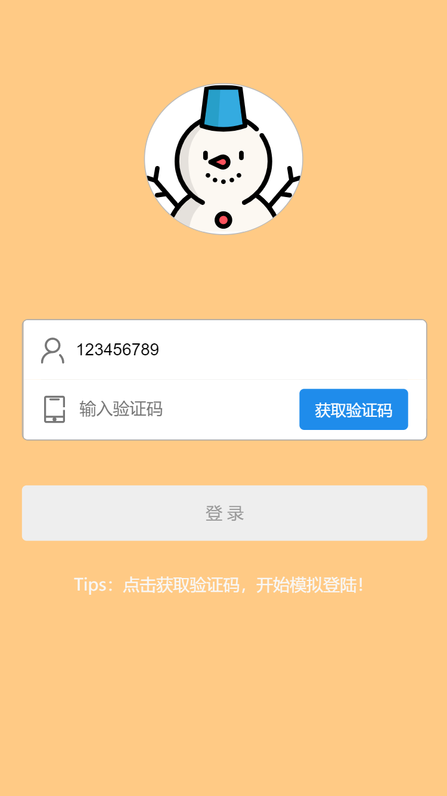

# Vue Demo

vue-demo 是一个使用 vue-cli 搭建的移动端 web 项目，它是一个测试项目，用于提升并检验自己的移动前端开发能力与代码组织能力。该项目正在维护中，目前可体验版本为 [v0.0.1](https://humiao7.github.io/vue-demo.github.io/#/) ，在线预览请点击 [Demo](https://humiao7.github.io/vue-demo.github.io/#/)，App下载请点击 [vue-app](https://www.pgyer.com/DPPU)


## 特点
**此项目为纯前端 web 展示项目，除内部图片文件等链接外不包含任何网络接口请求**

* 使用 [HipsUI](http://hippius-ui.hips.hand-china.com/#/zh-CN/quickstart) 完成主要功能界面开发
* 包含表单、列表、交互、附件、日历、瀑布流等主要界面功能展示
* 加入二维码、条形码动态生成功能
* 加入 [Echarts](https://echarts.apache.org/zh/index.html) 可视化图表展示功能
* 加入地图功能

## 目录
 - [如何开始](#如何开始)
 - [App预览](#App预览)
 - [文件结构](#文件结构)


## 如何开始

* 请先安装本地 [Node](https://nodejs.org/en/) 环境，要求 node 版本不低于 8.0.0
* 克隆地址: `git clone https://github.com/humiao7/vue-demo`
* 安装 npm 依赖: `npm install`
* 从指定源安装 hips ui: `npm i @hips/vue-ui -S --registry=http://nexus.saas.hand-china.com/repository/hzero-npm-group/`
* 构建本地运行环境: `npm run dev`
* 打包生产环境代码: `npm run build`

## App 预览

App功能预览.

|                  登录界面                  |                主菜单界面                |
| :----------------------------------------: | :--------------------------------------: |
|  |  |


## 文件结构

```
vue-demo/
│  .gitignore
│  index.html
│  package.json
│  README.md
│  
├─build
│      build.js
│      check-versions.js
│      utils.js
│      vue-loader.conf.js
│      webpack.base.conf.js
│      webpack.dev.conf.js
│      webpack.prod.conf.js
│      
├─config
│      dev.env.js
│      index.js
│      prod.env.js
│      
├─dist            
├─node_modules                
├─src
│  │  App.vue
│  │  main.js
│  │  
│  ├─api
│  │  │  index.js
│  │  │  
│  │  └─modules
│  │          halmFileGroupService.js
│  │          
│  ├─assets     
│  │     
│  ├─components
│  │      halm-file-group.vue
│  │      halm-task-line.vue
│  │      index.js
│  │      
│  ├─modules
│  │  ├─calendar
│  │  │  ├─api
│  │  │  │      index.js
│  │  │  │      
│  │  │  ├─i18n
│  │  │  │      en.js
│  │  │  │      index.js
│  │  │  │      zh.js
│  │  │  │      
│  │  │  ├─router
│  │  │  │      index.js
│  │  │  │      
│  │  │  ├─store
│  │  │  │      index.js
│  │  │  │      
│  │  │  ├─style
│  │  │  │      calendar.styl
│  │  │  │      
│  │  │  └─views
│  │  │          calendar.vue
│  │  │          
│  │  ├─charts       
│  │  ├─files        
│  │  ├─forms         
│  │  ├─lists       
│  │  ├─map         
│  │  ├─notes      
│  │  ├─page-404        
│  │  ├─payment         
│  │  ├─tab-bar         
│  │  ├─tabs         
│  │  └─waterfall  
│  │  
│  ├─router
│  │      index.js
│  │      
│  ├─style
│  │  │  common.styl
│  │  │  theme.styl
│  │  │  
│  │  ├─fsm-hzero-icons
│  │  │  │  .bower.json
│  │  │  │  README.md
│  │  │  │  
│  │  │  ├─css
│  │  │  │      fsm-hzero-icons.css
│  │  │  │      
│  │  │  └─fonts
│  │  │          icomoon.eot
│  │  │          icomoon.svg
│  │  │          icomoon.ttf
│  │  │          icomoon.woff
│  │  │          
│  │  └─Iconfont
│  │          demo.css
│  │          demo_index.html
│  │          iconfont.css
│  │          iconfont.eot
│  │          iconfont.js
│  │          iconfont.json
│  │          iconfont.svg
│  │          iconfont.ttf
│  │          iconfont.woff
│  │          iconfont.woff2
│  │          
│  └─utils
│          index.js
│          
└─static
        login.png
        main.png
```
